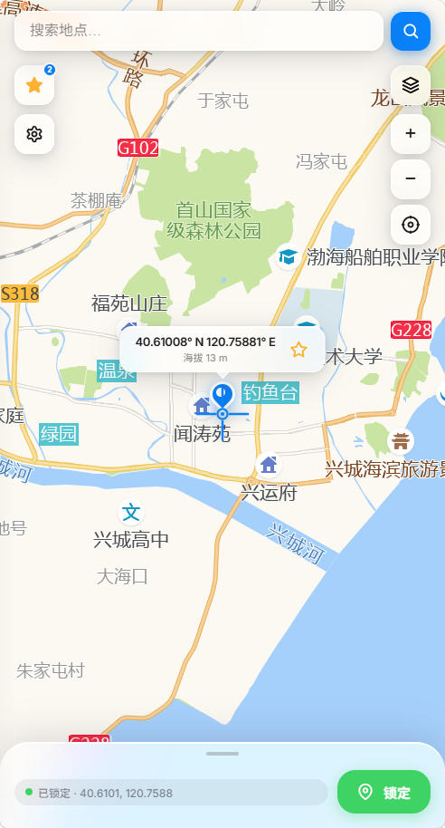
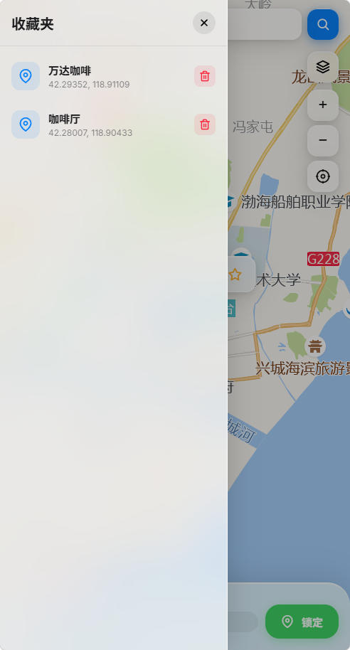
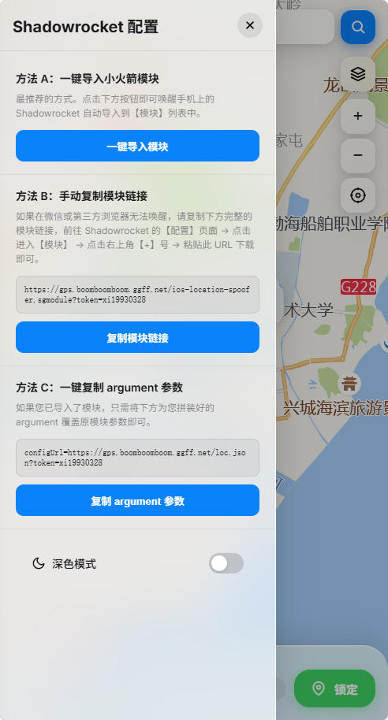
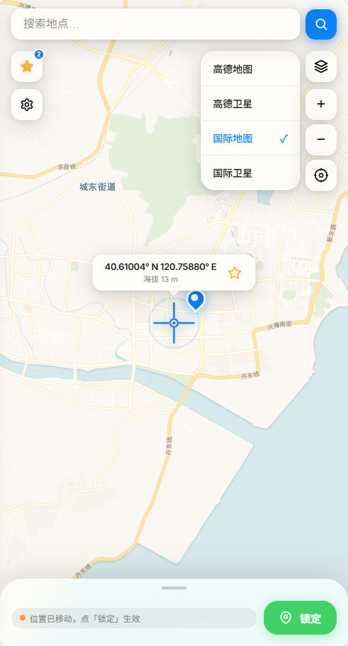
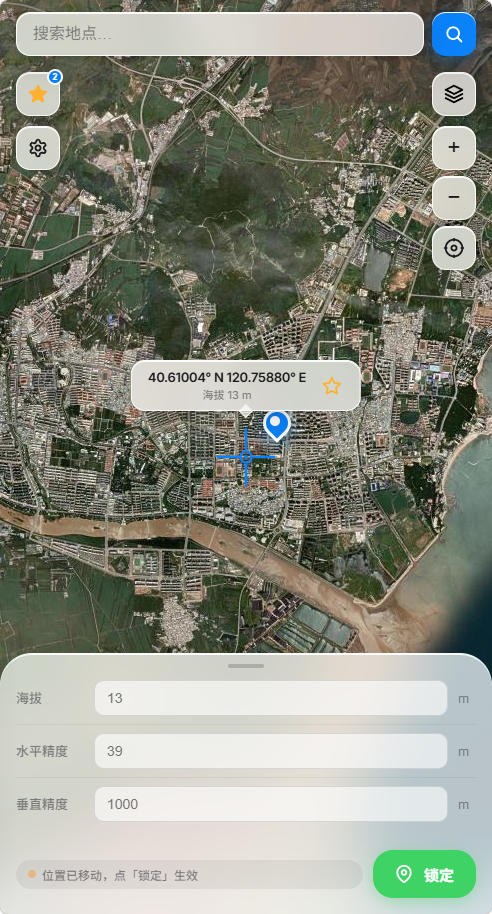
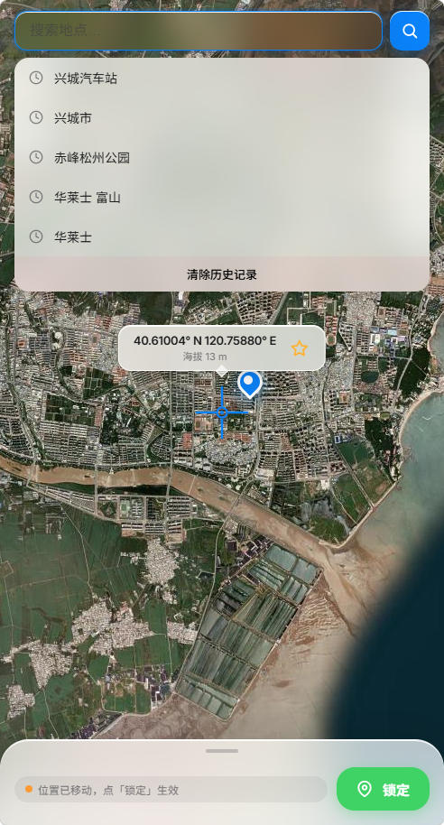

# iOS-Location-Spoofer-Web

> ### ⚠️ 【防骗与严禁倒卖声明】
> 本项目为 **100% 免费开源项目**（唯一官方开源仓库：[akudamatata/iOS-Location-Spoofer-Web](https://github.com/akudamatata/iOS-Location-Spoofer-Web)），遵循 **CC BY-NC-SA 4.0** 开源许可协议。
> **「严禁任何个人或组织以任何形式进行二次售卖、转售、商业收费代搭建、打包牟利等行为」**。
> 若您是通过闲鱼、淘宝、拼多多、付费微信群等任何渠道付费购买获得本项目的，**您已被欺诈，请立即向购买平台申请退款并举报不良商家！**

📱 基于 **Shadowrocket MITM** 方案的 iOS GPS 模拟定位 Web 管理面板（**个人单用户自建专属**）。

采用 Apple 2026 **Liquid Glass（液态玻璃）** 视觉美学设计，全屏地图选点，后端与核心规则支持 100% 独立自建托管。

---

## 🌟 核心特性

| | 特性 | 说明 |
|---|---|---|
| 🗺 | **多地图切换** | CartoDB / Esri 卫星 / 高德地图 / 高德卫星，支持国内外全域定位 |
| 🎯 | **准星锁定** | 滑动地图对准目标，点击锁定后地图显示蓝色图钉标记已生效坐标 |
| 📍 | **当前位置** | 一键回到当前物理位置并自动纠偏对齐 |
| 🔒 | **后端完全自建** | 内置自托管 `location-spoofer.js` 与规则模块，无需依赖任何外部规则订阅 |
| 👤 | **个人专属架构** | 专为个人单用户设计的极简 Serverless 架构，单实例专属，零维护成本 |
| ⭐ | **智能收藏夹** | 毛玻璃面板，保存常用地点；已收藏位置星标实时高亮，支持一键切换与取消 |
| 🔢 | **高级参数** | 可调节海拔、水平精度、垂直精度（支持按地形自动获取海拔高度）|
| 🔍 | **坐标直跳** | 搜索框直接粘贴经纬度（如 `39.9087, 116.3975`）即刻精准跳转 |
| 🌙 | **深色模式** | 设置面板内一键切换深色/浅色，偏好自动记忆 |
| 📲 | **PWA 支持** | Safari「添加到主屏幕」后全屏运行，体验对齐原生 iOS App |
| ⚡️ | **WLOC 最小改写** | 采用最小改写策略（Minimal Rewrite）与滑窗扫描兜底，稳定适配最新 iOS 系统 |

### 📸 界面预览

<table align="center">
  <tr>
    <td align="center" width="33%">
       
      <b>全屏地图选点</b>
    </td>
    <td align="center" width="33%">
       
      <b>智能收藏夹</b>
    </td>
    <td align="center" width="33%">
       
      <b>设置与小火箭配置</b>
    </td>
  </tr>
  <tr>
    <td align="center" width="33%">
       
      <b>多图层图源切换</b>
    </td>
    <td align="center" width="33%">
       
      <b>卫星图与高级参数</b>
    </td>
    <td align="center" width="33%">
       
      <b>地点搜索与历史</b>
    </td>
  </tr>
</table>

---

## 📱 系统与客户端兼容性矩阵

| 平台 / 系统 / 软件 | 版本范围 | 支持状态 | 说明 |
|---|---|---|---|
| **iOS / iPadOS** | iOS 12.0 ~ iOS 26.x | 🟢 完美支持 | 覆盖所有主流正式版系统，零 BigInt 纯原生实现，稳定运行 |
| **iOS / iPadOS** | iOS 27 beta 1 ~ beta 5 | 🟢 完美支持 | 已跟进 WLOC 最小改写策略与封装扫描兜底 |
| **iOS / iPadOS** | iOS 27 beta 6 及以上 | ⚠️ 系统受限 | 苹果在系统定位组件开启了强 TLS 证书固定（Pinning），目前所有 MITM 方案均受限 |
| **Shadowrocket** | v2.2.x 及以上版本 | 🟢 完美支持 | 需开启 HTTPS 解密并信任 CA 证书 |

---

## 🌐 外部服务与数据隐私边界

为了在浏览器端提供流畅的地图交互和选点体验，前端 Web 面板在必要时会直接请求以下公开 WebGIS 与基础服务：

1. **地图底图瓦片 (Map Tiles)**：
   - 高德地图 / 高德卫星（国内推荐，加载高德官方公开瓦片）
   - CartoDB / Esri World Imagery（国外底图与高精度卫星影像）
2. **地点搜索接口 (Geocoding)**：
   - 高德 Web 服务 API（如配置 `AMAP_KEY`，用于国内地名关键字联想）
   - OpenStreetMap Nominatim（未配置高德 Key 时的国际搜索备用源）
3. **地形海拔查询**：
   - Open-Meteo Elevation API（点击地图时自动获取目标坐标的真实地形海拔）
4. **静态前端资源 CDN**：
   - `unpkg.com`（Leaflet 地图基础库）、`Google Fonts`（Inter 字体）

> 💡 **数据安全声明**：所有自建配置、Token 鉴权、当前定位坐标与收藏夹数据均仅保存在您私有部署的 Cloudflare KV 中，绝不向任何第三方上传您的私有定位坐标记录。

---

## 🛠 快速部署 (Cloudflare Pages)

本项目专为 **Cloudflare Pages** 设计，部署于全球边缘节点，实现 **零维护、零服务器成本、个人专属**。

### 1. 准备工作
- 注册并登录 [Cloudflare](https://dash.cloudflare.com/) 账号。
- 在 Cloudflare Dashboard 左侧菜单找到 **Workers & Pages** -> **KV**。
- 创建一个新的 KV 命名空间，命名为 `SPOOFER_DATA`。

### 2. Fork 仓库
点击右上角的 Fork，将本仓库 Fork 到您的 GitHub 账号下。

### 3. 创建 Pages 项目
1. 在 Cloudflare Dashboard 侧边栏进入 **Workers & Pages** -> **Overview**，点击右上角 **Create application** (创建应用程序)。
2. ⚠️ **关键：请务必点击顶部的「Pages (网页)」标签卡**（切勿停留在默认的 Workers 标签卡上），然后点击 **Connect to Git** (连接到 Git)。
3. 授权连接您的 GitHub，选择您刚才 Fork 的仓库。
4. 在构建设置 (Build settings) 页面：
   - **Framework preset** (框架预设): 选择 `None`
   - **Build command** (构建命令): 填写 `exit 0`
   - **Build output directory** (构建输出目录): 填写 `public`
5. 展开 **Environment variables (advanced)** (环境变量)，添加以下变量：
   - `TOKEN`: 您的私有访问密码（必填，用于面板访问与接口鉴权，服务端已做安全脱敏保护）
   - `AMAP_KEY`: 您的高德地图 Web 服务 Key（用于国内高精度地名搜索，可选但强烈推荐）
6. 点击 **Save and Deploy**（保存并部署）。首次部署由于尚未绑定 KV 会提示无法保存数据，这是正常的，请继续下一步。

### 4. 绑定 KV 命名空间
1. 部署完成后，进入该 Pages 项目的详情页，点击顶部的 **Settings** -> **Functions**。
2. 往下滚动找到 **KV namespace bindings**。
3. 点击 **Add binding**：
   - **Variable name (变量名称)**: 填入 `SPOOFER_DATA` （必须完全一致）
   - **KV namespace (KV 命名空间)**: 选择您在第一步创建的 `SPOOFER_DATA`。
4. 重新部署一次生效：回到该项目的 **Deployments (部署)** 页面，点击列表最上面一次部署右侧的 `...` 图标 -> **Retry deployment (重试部署)**。

部署完成后，您将获得一个类似 `https://your-project.pages.dev` 的专属域名，可直接通过手机访问面板！

---

## 📲 Shadowrocket 配置指南

### 1. 添加为模块 (Module)

1. 在手机浏览器打开面板，输入您的 Token 登录。
2. 点击页面右上角 **「⚙️ 设置」** 图标，复制**模块链接**。
3. 打开 Shadowrocket → 底部 **「配置」** 标签页 → 点击进入 **「模块 (Modules)」**。
4. 点击右上角 **「+」** → 粘贴刚才复制的链接 → 点击**下载**。
5. 确保下载好的 `iOS Location Spoofer` 模块开关处于**开启**状态。

### 2. 开启 HTTPS 解密与安装证书

点击当前配置文件进入详情 → **「HTTPS 解密」**：

1. 开启 **「HTTPS 解密」** 开关
2. 开启 **「通过 HTTP/2 进行中间人攻击 (MitM)」** 开关
3. 点击 **「证书」** → **「生成新的 CA 证书」** → **「安装证书」**
4. 前往 iPhone **「设置 → 通用 → 关于本机 → 证书信任设置」**，找到 Shadowrocket 证书并**完全信任**

### 3. 启动 VPN

回到小火箭首页，开启 VPN 开关，模式保持 **「配置 (Config)」** 即可。

---

## 🧭 日常使用流程

1. **打开面板**：手机浏览器访问面板地址，输入 Token 登录（登录后 30 天内免密直接进入）
2. **选点**：拖动地图准星，或顶部搜索框输入地名 / 直接粘贴经纬度（如 `39.9087, 116.3975`）
3. **锁定**：点击 **「锁定」** 按钮，地图上出现蓝色图钉，提示"位置已锁定"
4. **刷新定位**：前往 iPhone **「设置 → 隐私与安全 → 定位服务」**，关闭后等 10 秒再重新开启
5. **验证**：打开高德地图、微信或系统地图，此时模拟定位已顺利生效 ✅

> **换位置**：重复步骤 2-4 即可，无需重启小火箭。  
> **收藏常用地点**：锁定位置后点击准星旁的 ⭐ 星标即可收藏，再次点击实心星可取消收藏。  
> **夜间使用**：点击设置面板底部的「深色模式」开关，偏好自动记忆。  
> **添加到主屏幕 (PWA)**：在 Safari 中点击「分享」→「添加到主屏幕」，即可像 App 一样全屏使用。

---

## ⚖️ 项目声明与免责条款

1. **原创研发**：本项目全量源码（包括 Liquid Glass Web 前端设计、Cloudflare Pages Serverless 后端 API 体系、以及基于纯 JS 原生实现的 `location-spoofer.js` 核心代理拦截改写引擎）均为**100% 独立自主设计与研发编写**。
2. **免责声明**：本项目仅供开发者用于地图开发测试、地理位置接口调试以及技术性学习研究，请勿用于非法用途。因违规使用产生的一切风险与后果由使用者自行承担。

---

## 📄 开源授权与使用条款

本项目采用 **[Creative Commons Attribution-NonCommercial-ShareAlike 4.0 International (CC BY-NC-SA 4.0)](https://creativecommons.org/licenses/by-nc-sa/4.0/)** 许可协议。

**核心约束条款：**
* **署名 (Attribution)**：在衍生项目、教程或分享中必须保留原作者信息及本项目 GitHub 仓库链接。
* **非商业性使用 (Non-Commercial)**：**「严禁以任何形式进行二次售卖、转售、商业收费代搭建、打包牟利等行为」**。
* **相同方式共享 (Share-Alike)**：若您修改、转换或以此代码为基础进行创作，必须采用相同或兼容的 CC 协议进行开源共享。

---

## 🔗 友情链接

- [LINUX DO - 新的理想型社区](https://linux.do/)
